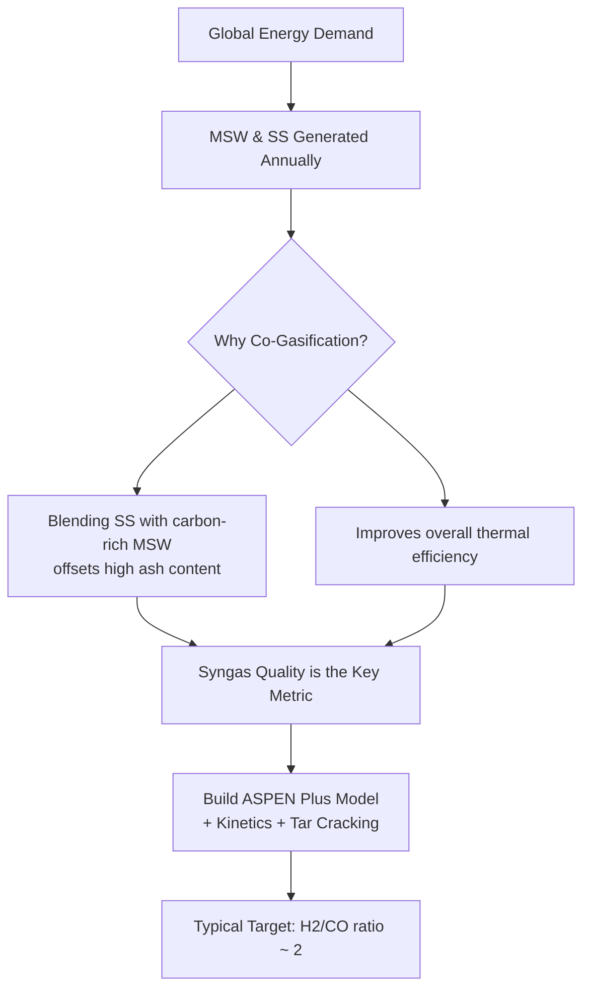
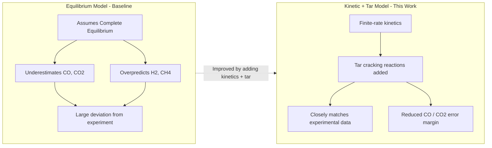
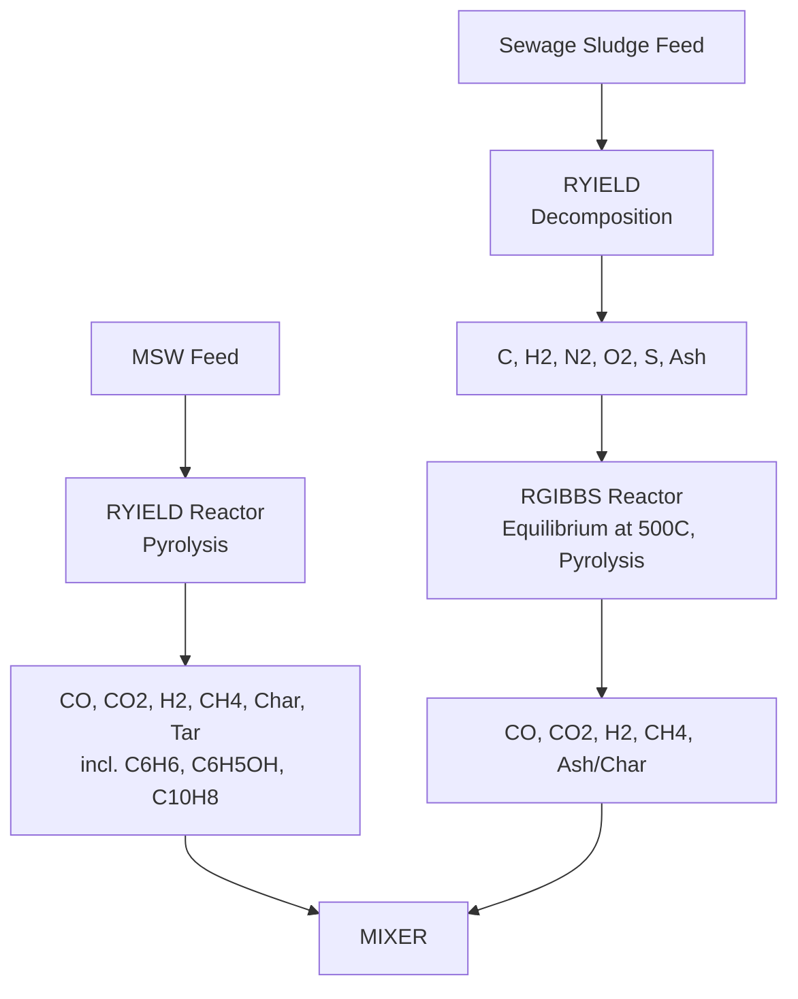
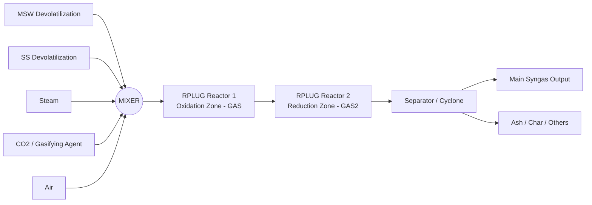
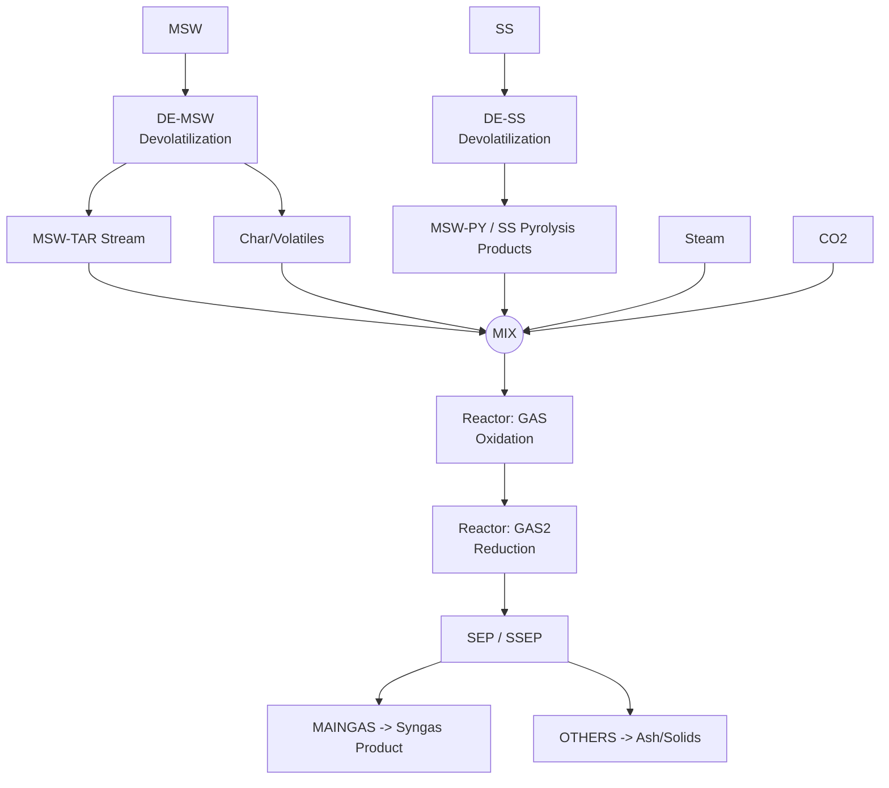
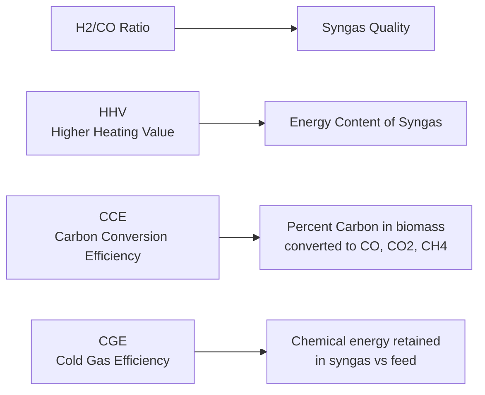
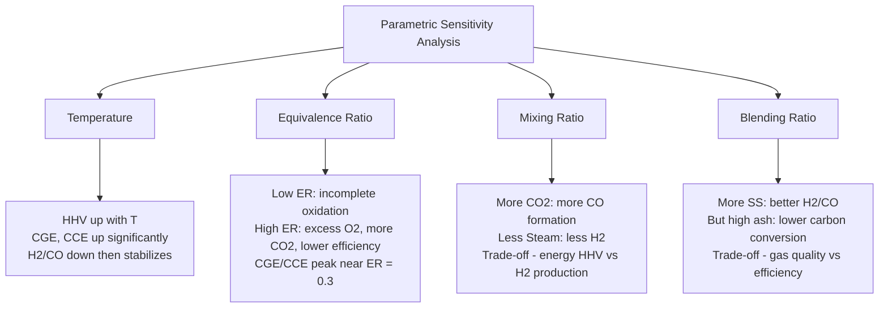
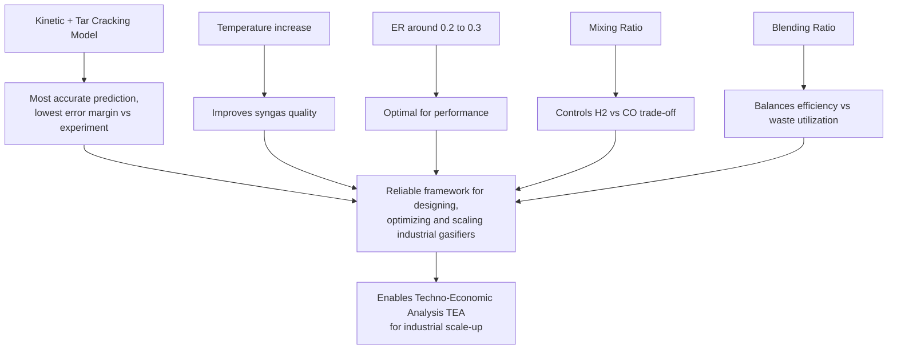

# ASPEN Plus Simulation of Co-Gasification of Municipal Solid Waste (MSW) & Sewage Sludge (SS)

**BTP / Internship Project — Crest Lab, Department of Chemical Engineering, IIT Indore**

| | |
|---|---|
| **Author** | Abhinav Singh (230008002), Final-Year Chemical Engineering, IIT Indore |
| **Supervisor** | Dr. Rajan Singh, DUGC, Chemical Engineering, IIT Indore |
| **Tool** | ASPEN Plus (Kinetic + Tar-integrated model) |
| **Reactor** | 1 kW thermal-capacity bubbling fluidized-bed gasifier |


*Full project poster (click/open the image for complete details, all figures, and data tables).*

---

## 1. Overview

Municipal Solid Waste (MSW) and Sewage Sludge (SS) are generated in enormous quantities every year and are usually treated as separate, low-value waste streams. This project builds a **kinetic- and tar-integrated ASPEN Plus model** to simulate their **co-gasification**, producing syngas that can be used for downstream power/heat generation.

Conventional **thermodynamic equilibrium models** over-simplify gasification by assuming complete conversion — this project shows that adding **reaction kinetics + tar cracking** brings simulated syngas composition much closer to real experimental data.



---

## 2. Why Equilibrium Models Fail

Standard Gibbs/equilibrium-based gasification models assume the reactor reaches complete thermodynamic equilibrium — which is unrealistic for real fluidized-bed gasifiers.



**Key findings (Fig. 1):**
- Equilibrium model → underestimates CO, CO₂; overpredicts H₂, CH₄ (assumes full equilibrium).
- Kinetic model **without** tar cracking → still has CO/CO₂ error margin.
- Kinetic model **with** tar cracking → closely matches experimental syngas composition.

---

## 3. Feedstock Characterization

| Ultimate Analysis (wt%, dry basis) | C | H | O | N | S |
|---|---|---|---|---|---|
| MSW | 35.70 | 3.01 | 15.35 | 1.05 | 0.82 |
| SS | 33.31 | 4.63 | 51.69 | 4.40 | 5.97 |

| Proximate Analysis (wt%, as entered) | Moisture | VM | FC | Ash | HHV (MJ/kg) |
|---|---|---|---|---|---|
| MSW | 30.85 | 47.10 | 8.93 | 43.97 | — |
| SS | — | 50.10 | 9.50 | 40.40 | 13.11 |

- **Co-gasification synergy:** blending SS with carbon-rich MSW offsets MSW's high ash content (40.4%), improving overall thermal efficiency.
- **High volatility:** elevated volatile matter (~47–50 wt%) in both feedstocks enables rapid devolatilization into syngas.

---

## 4. Simulation Framework (Materials & Methods)

### 4.1 Dual-Feed Decomposition Strategy



### 4.2 Sequential Gasification Framework

Two consecutive **RPLUG** (plug-flow kinetic) reactors model the distinct **oxidation** and **reduction** zones of the fluidized-bed gasifier:



### 4.3 Overall ASPEN Plus Block Flow Diagram



**Reaction chemistry modeled:**
- **Devolatilization:** MSW and SS separately decompose into char, volatile gases, and tars.
- **Kinetic reaction:** Volatiles mix with steam and CO₂ across the GAS and GAS2 reactors.
- Boudouard reaction: `C + CO2 → 2CO` (endothermic, favored at high T; promotes tar cracking, increases CO/H2, reduces CH4).
- Rate governed by the **Arrhenius equation**: `r = A · exp(-Ea / RT)`.

---

## 5. Key Parameters & Performance Metrics

| Parameter | Range Studied | Role |
|---|---|---|
| **Temperature (T)** | 750 – 950 °C | Controls reaction kinetics; higher T promotes endothermic Boudouard reaction (tar cracking, more CO/H2, less CH4) |
| **Equivalence Ratio (ER)** | 0.1 – 0.4 | Ratio of actual air to theoretical (stoichiometric) air; controls oxidation level. Low ER → fuel-rich; High ER → fuel-lean |
| **Mixing Ratio (MR)** | 0 – 100% | `MR (vol%) = CO2(L/min) / [CO2 + Steam](L/min)` — determines gasifying-agent composition |
| **Blending Ratio (BR)** | 0 – 100% | `BR (%) = kW produced by SS / Total 1 kW` — fraction of Sewage Sludge in the feed mixture |

**Performance metrics evaluated:**



- `HHV (MJ/kg) = 10.16·CO% + 142.08·H2% + 55.384·CH4%`
- `CCE (%) = [(12/28)·CO + (12/44)·CO2 + (12/16)·CH4] / (C% in biomass + C% in agent)`
- `CGE (%) = (HHV_syn · m_syn) / 3.6`

---

## 6. Sensitivity Analysis — Results Summary



| Variable | Effect on HHV | Effect on H2/CO | Effect on CCE / CGE |
|---|---|---|---|
| **Temperature ↑ (750→950°C)** | Increases steadily | Decreases initially, then stabilizes | Both increase significantly |
| **Equivalence Ratio ↑ (0.1→0.4)** | Decreases at high ER (0.4) | Fluctuates | Peak near ER ≈ 0.3, then drops |
| **Mixing Ratio ↑ (0→100% CO2)** | Increases up to ~80%, then dips slightly | Decreases continuously | CGE peaks ~80%; CCE increases steadily |
| **Blending Ratio ↑ (0→100% SS)** | Increases | Increases significantly | CGE increases continuously; CCE decreases at higher SS% |

**Optimal operating point identified:** **T = 800 °C**, giving an optimal syngas ratio **H₂/CO = 0.89**.

---

## 7. Conclusions



- The **kinetic + tar-cracking** model gives the most accurate prediction of syngas composition and the lowest error margin compared to equilibrium-only models.
- **Temperature increases** improve syngas quality; **ER of 0.2–0.3** is optimal for performance.
- **Mixing Ratio (MR)** controls the H₂ vs CO trade-off; **Blending Ratio (BR)** balances process efficiency against waste utilization.
- The model serves as a **reliable framework** for designing, optimizing, and scaling industrial co-gasification systems, and enables comprehensive **techno-economic analysis (TEA)** for industrial scale-up.

---

## 8. References

1. G.-B. Chen and Y.-T. Hsu, *Energy*, 329 (2025) 136820.
2. World Bioenergy Association (WBA) & BP World Energy Report (2022).
3. *International Journal of Environmental Science and Development*, Vol. 1, No. 3, August 2010.

---

## 9. Repository Contents

```
├── README.md              # This file
└── images/
    └── poster.png          # Full project poster (all figures & data)
```

> **Note:** This README summarizes the poster presented for the BTP/internship project at Crest Lab, IIT Indore. Refer to `images/poster.png` for the complete set of figures (Fig. 1–8), raw plots of sensitivity analysis, and detailed process flow diagrams.
